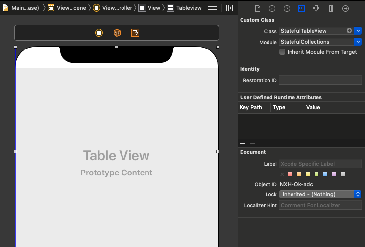
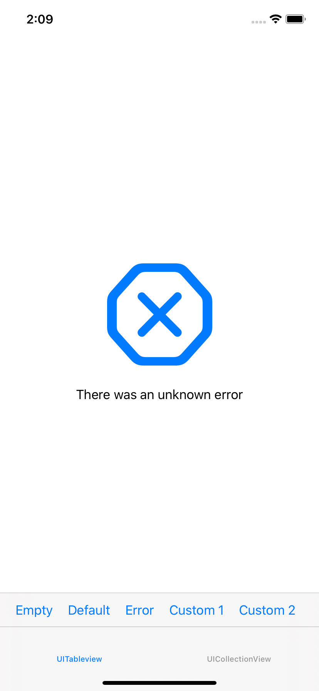
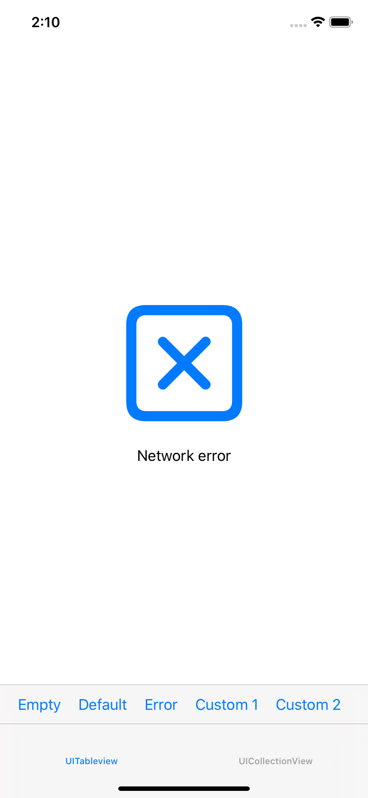

# StatefulCollections
> Simple stateful collection views for iOS in Swift.


[![Swift Version][swift-image]][swift-url]
[![Build Status][travis-image]][travis-url]
[![License][license-image]][license-url]

[](http://cocoapods.org/pods/StatefulCollections)
[](http://makeapullrequest.com)

StatefulCollections is a small and lightweight Swift framework that allows to create UITableviews and UICollectionViews that support empty, loading and error states as easy as possible.

It can be partially customized to allow greater flexibility while keeping things simple. It has a nice balance between view customization and ease of use.


## Features

- [x] Simple to use
- [x] Customizable
- [x] Supports empty, loading and error states

## Requirements

- iOS 13.0+
- Xcode 11.3

## Installation

### CocoaPods

[CocoaPods](https://cocoapods.org) is a dependency manager for Cocoa projects. For usage and installation instructions, visit their website. To integrate StatefulCollections into your Xcode project using CocoaPods, specify it in your `Podfile`:

```ruby
pod 'StatefulCollections'
```


## Basic Usage

Import StatefulCollections module wherever you have a reference to a UITableView or UICollectionView that will be used as stateful.
Set your collection style view classes to its matching subclass, StatefulTableView or StatefulCollectionView

```swift
import StatefulCollections

class ViewController: UIViewController {

    @IBOutlet weak var tableview: StatefulTableView!
    @IBOutlet weak var collectionview: StatefulCollectionView!

// ...

}
```

Set the class and the import module in storyboard if needed.



When you want to set the state of the view, set it using `setStateTo`: 
```swift

tableview.setState(to: .loading)
collectionview.setState(to: .empty)

```

Both views support four different states:

| State            | View            |  Image             |  Text             | Use             |
| ------------- | ------------- | ------------- | ------------- | ------------- |
| .normal         | Standard view appearance, uses normal separator style as default. | N/A | N/A | Used as default state, when there is content to show. |
| .loading        | Removes cell separator, shows activity indicator and the default text. | N/A | 'Loading...' | Used when loading or processing data (Core Data, networking, file parsing, etc). |
| .emtpy            | Removes cell separator, shows SF Image and the default text. | 'text.badge.xmark' | 'No results' |Used when there are no results to show.      |
| .error            | Removes cell separator, shows SF Image and the default text. | 'xmark.octagon' | 'There was an unknown error' | Used when the process of obtaining data for the collection has failed (I/O errors, networking,etc). |

## Customization

StatefulCollections allow a certain degree of customization but tries to keep things as simple as possible.

Although you can't add or remove the basic view components of each state, the ones shown can be customized. Images, labels and separator styles can be freely modified.

For example:
```swift
tableview.setState(to: .error)
```
will give your tableview the following appearance:


However, you can set the image and the text to another values:
```swift
let errorImage = UIImage(systemName: "clear")
tableview.setImage(to: errorImage forState: .error)
tableview.setText(to: "Network error", forState: .error)

// ...

tableview.setState(to: .error)

```


## Reloading data

When reloading data it will automatically reset its state to `.normal` if the view's datasource number of available rows in any section is bigger than 0. If not, it will keep the last set state, so it's up to you to change it if needed.

## Reset states

If you want to reset any state appearance to its original settings, just use `resetState` or `resetAllStates`:  

```swift

tableview.setText(to: "Server error", forState: .error)
tableview.setText(to: "Loading data from disk...", forState: .loading)
tableview.setText(to: "There were no results for your query", forState: .empty)

// ...

tableview.reset(state: .error) // Only error state will be reset

// ...
tableview.resetAllStates // Every state will be reset to default values

```

## Contribute

If you want to contribute to **StatefulCollections**, check the ``LICENSE`` file for more info.

## Meta

Guillem Espejo –  g.espejogarcia@gmail.com

Distributed under the MIT license. See ``LICENSE`` for more information.

[https://github.com/GuillemEspejo/github-link](https://github.com/GuillemEspejo/)

[swift-image]:https://img.shields.io/badge/swift-5.0-orange.svg
[swift-url]: https://swift.org/
[travis-image]: https://img.shields.io/travis/dbader/node-datadog-metrics/master.svg?style=flat-square
[travis-url]: https://travis-ci.org/dbader/node-datadog-metrics
[license-image]: https://img.shields.io/badge/License-MIT-blue.svg
[license-url]: LICENSE
